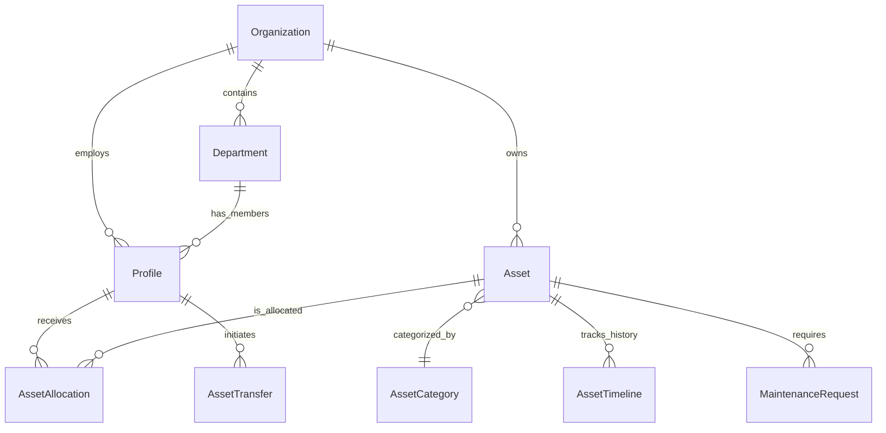
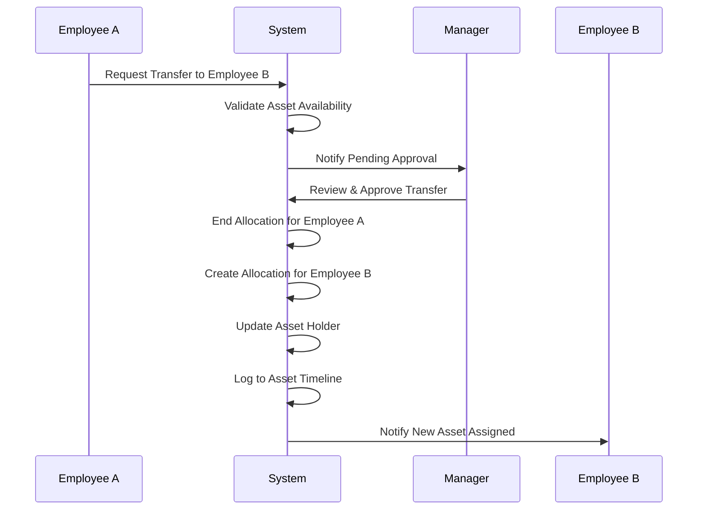
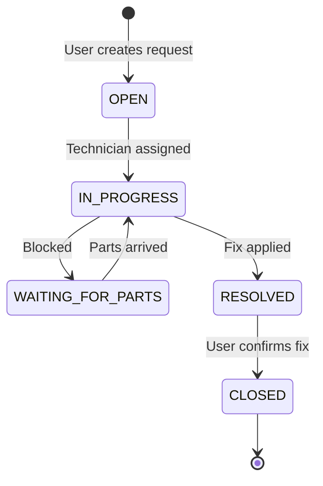

# Architecture Diagrams

The following diagrams illustrate the core workflows and structural components of AssetFlow.

## 1. System Architecture

```mermaid
graph TD
    Client[Web Browser / PWA] -->|HTTPS| NextJS[Next.js App Router]
    
    subgraph "Vercel (Compute)"
        NextJS -->|React Server Components| UI[UI Components]
        NextJS -->|API Routes| AuthMiddleware[Auth & RBAC Middleware]
        AuthMiddleware --> Services[Business Logic Services]
        Services --> Repos[Prisma Repositories]
        Services -->|Dependency Injection| AI[AI / OCR Providers]
    \end
    
    subgraph "Supabase (Data Layer)"
        Repos -->|TCP/PgBouncer| PostgreSQL[(PostgreSQL DB)]
        AuthMiddleware -->|JWT Verification| SupaAuth[Supabase Auth]
        PostgreSQL --> RLS[Row Level Security]
    \end
```

## 2. Database Entity Relationship (ER)



## 3. Asset Transfer & Approval Workflow



## 4. Maintenance Lifecycle


